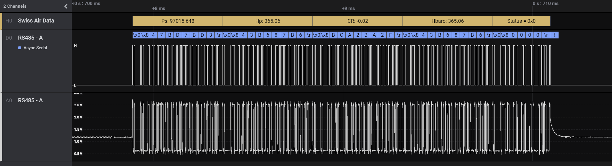
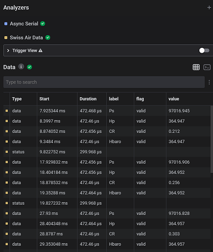
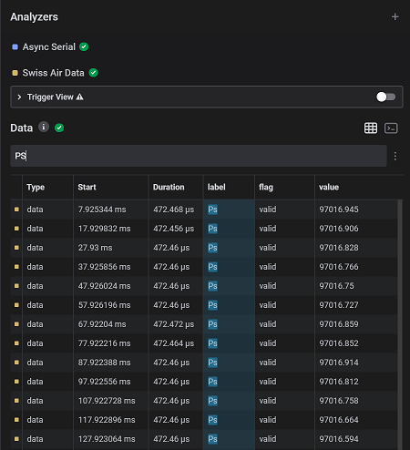

  # Swiss Air Data decoder
  
## Overview

This Saleae Logic2 high level analyser extension decodes air data frame sent by a module from Simtec AG <https://www.swiss-airdata.com/>. 

An analyzer should decode the logic level to provide bytes to this High Level Analyser. For now, it is compatible with RS485 bus as it can be decoded by the Async Serial but not compatible with ARINC-429 bus. Details about the format used to send the air data can be found in devices Interface Control Document

The label and the value of the data transmitted are displayed on top of the frame, as shown bellow

In the data table, flag of the data transmitted is also displayed

It can be convenient to add a filter on the table to see the time evolution of a specific data.

**Warning: Only data and status packet are parsed. Commands, such as QNH setting and sensor zeroing are ignored by this extension** 

 ## How to use it

To try this extension out for yourself, you will first need to capture a communication data:

 1. Open Logic 2 (2.3.0 or greater)
 1. Capture a frame sent by an air data computer, pin RS485-A. If you don't have one you can use the provided capture to try this extension [support/example-capture.sal](support/example-capture.sal)
 1. Add an *Async Serial* analyser, with the following configuration
    - Bit rate : depends on the configuration
    - Bits per frame: 8
    - Stop Bits: 1
    - Parity Bit: No parity
    - Significant bit: Least significant bit sent first
    - Signal inversion: Non inverted
    - Mode: Normal
 1. Add the *Air Data - Simtec*  analyser. Select the *Async Serial* as input analyser

 ## Notes

Tested with Logic 2, version 2.3.19

This library is distributed in the hope that it will be useful, but WITHOUT ANY WARRANTY; without
even the implied warranty of MERCHANTABILITY or FITNESS FOR A PARTICULAR PURPOSE.

Simtec AG has no obligation to provide maintenance, support,  updates, enhancements, or modifications.